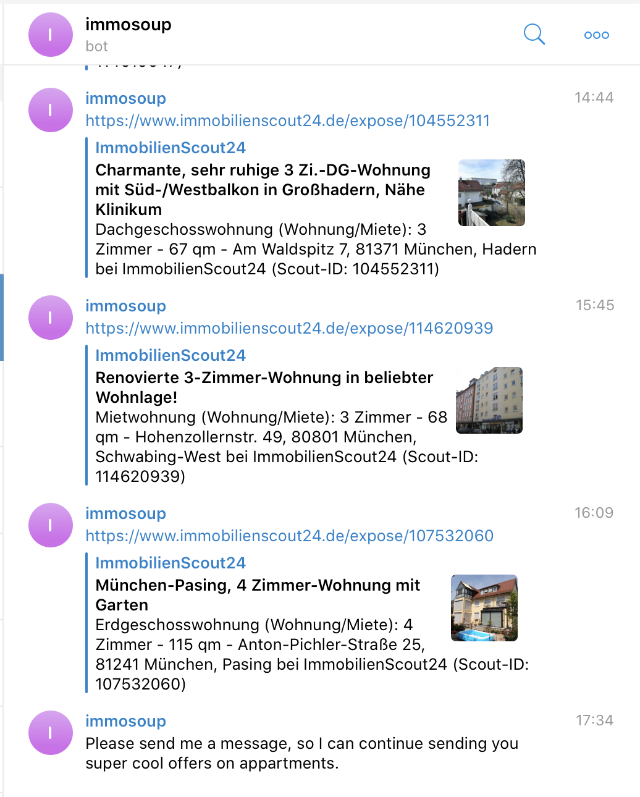

# immosoup 🤖🏘️

__immosoup__ is a Telegram bot that scrapes Immoscout24 and Immonet for new affordable appartments in Munich using [BeautifulSoup](https://www.crummy.com/software/BeautifulSoup/bs4/doc/). 

immosoup will send you Telegram notifications whenever a new appartment is put online. From our experience searching for appartments, being the fastest to reply when a new appartment is posted is key to being invited to appartment inspections. 

However, both of these websites do __not__ provide you with notifications that are timed in this way, but rather, aggregate information over a certain period of time and then send notifications to you. Depending on how lucky you are, __this can even mean you wait several hours until you see a newly posted appartment__. 

immosoup counteracts this problem by scraping the websites in a much higher frequency so that __you can always be the first one to reply 🤩__. 

### Happy appartment searching 🎉 !

# How To:

1. You can adjust your appartment query by changing `page_url_immoscout` and `page_url_immonet` (in `main.py`) according to your needs. We recommend to sort the immobilienscout24 and immonet pages by 'Newest Entries First'. 

2. Grab a telegram bot ID. A tutorial for that can be found [here](https://docs.microsoft.com/en-us/azure/bot-service/bot-service-channel-connect-telegram?view=azure-bot-service-4.0). Make sure to grab the `BOT_ID`.

3. Run the script via: `python main.py [BOT_ID]`

# Authors
- [johannesrohwer](https://github.com/johannesrohwer)
- [melloskitten](https://github.com/melloskitten)
